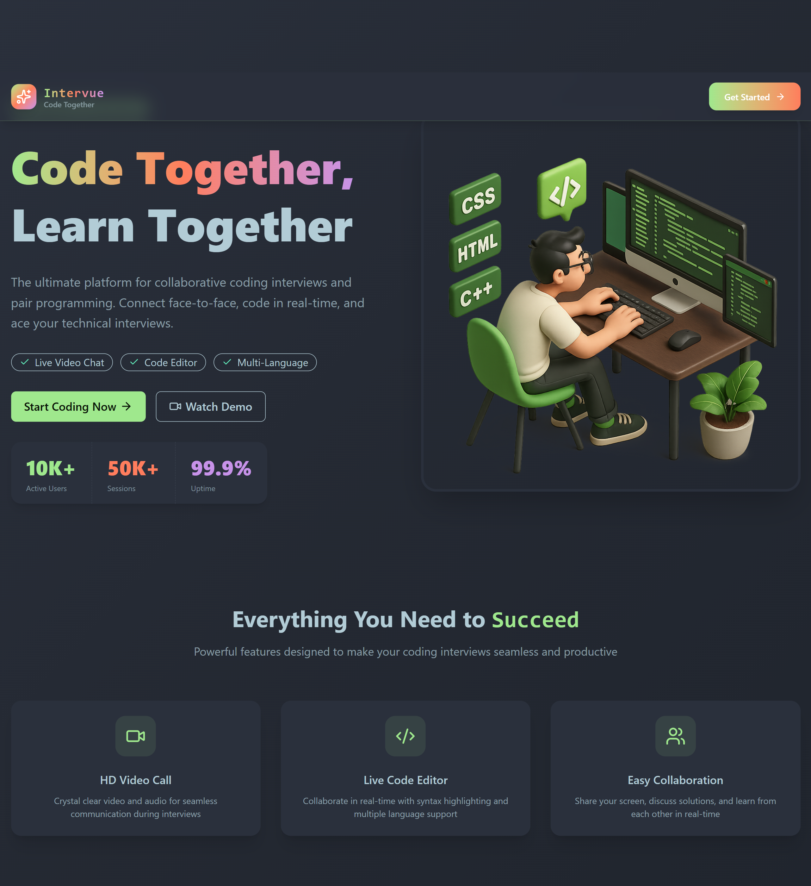
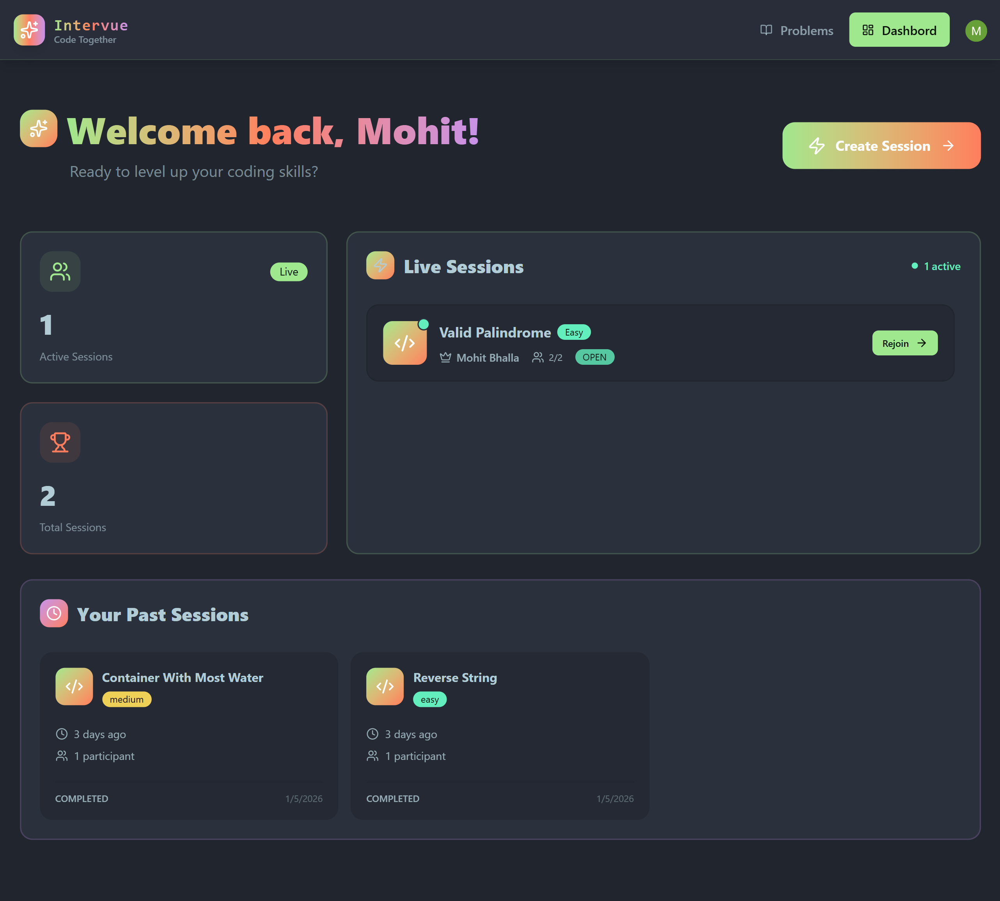
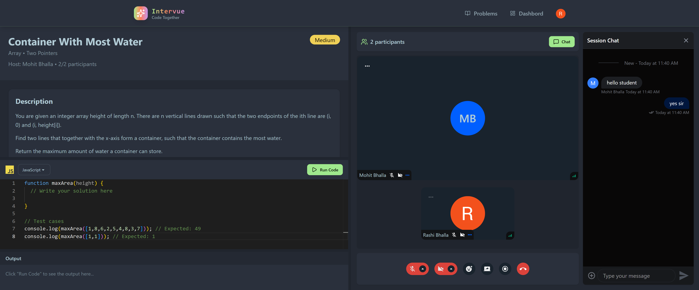
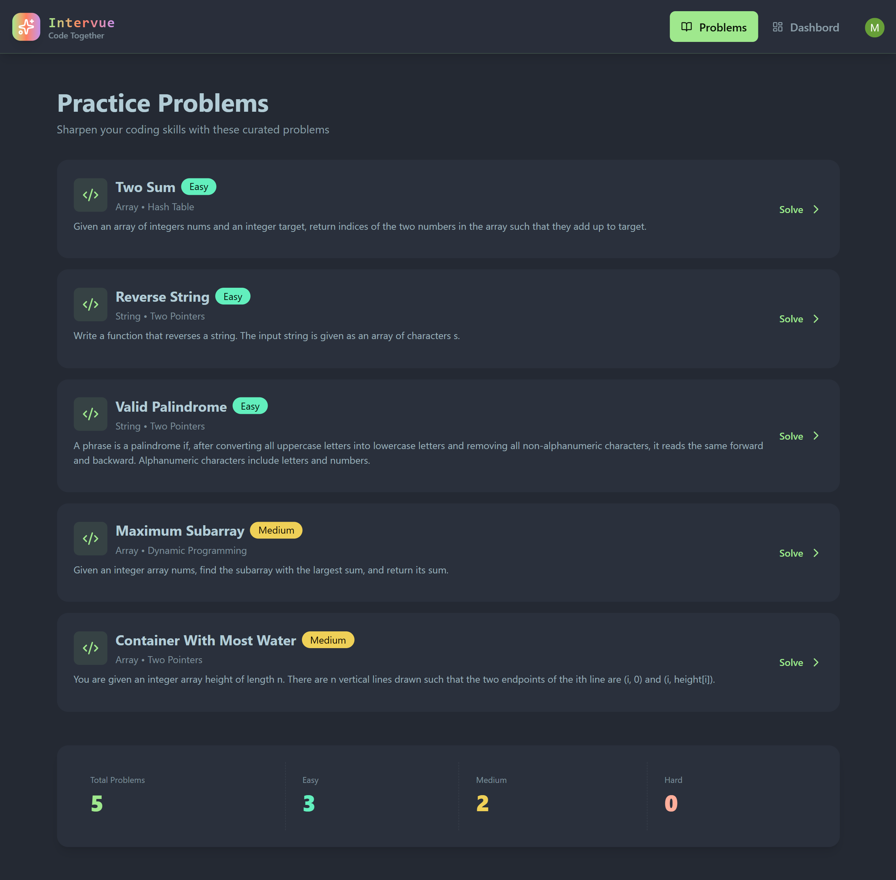
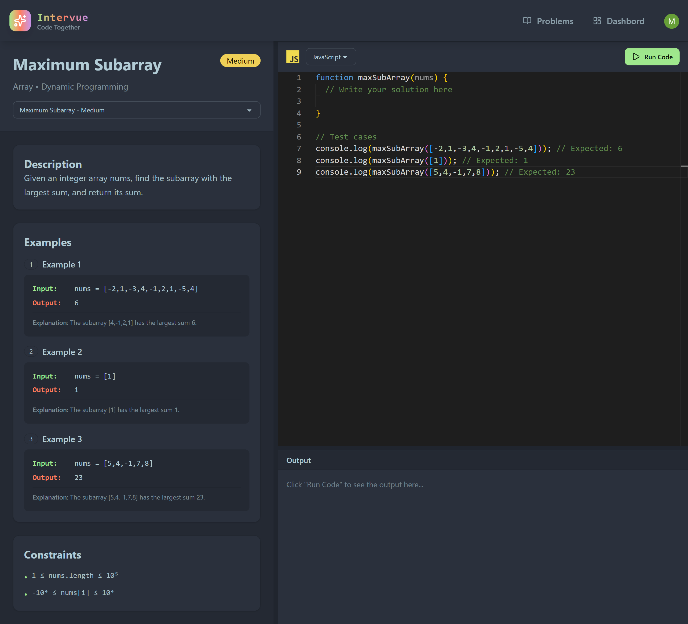

<h1 align="center">✨ Intervue ✨</h1>

<p align="center">
  <strong>The Future of Technical Hiring</strong><br>
  A high-performance, 1-on-1 interview platform with integrated video, real-time chat, and multi-language code execution.
</p>


## 📽️ Visual Walkthrough

### 1. The Gateway (Home Page)
The journey begins with a secure, professional landing page. Powered by **Clerk**, users can authenticate seamlessly to access their personalized workspace.


<p align="center">
  
</p>

### 2. Live Insights (Dashboard)
Once logged in, the **Dashboard** serves as the command center.
* **Live Stats:** Track interview performance and total sessions.
* **Session Management:** Create new 1-on-1 rooms or view history.
* **State Management:** Powered by **TanStack Query** for lightning-fast data fetching.


<p align="center">
  
</p>

### 3. The Interview Suite (1-on-1 Session)
This is where the magic happens. A fully immersive, synchronized environment for both the interviewer and candidate.
* **Video & Audio:** Crystal clear 1-on-1 calling with Mic/Camera toggles and Screen Sharing via **Stream API**.
* **Code Editor:** A VSCode-powered IDE using **Monaco Editor**.
* **Dynamic Layout:** Split-view resizing using **React-Panel-Resize**.
* **Real-time Chat:** Instant messaging to share hints or feedback.


<p align="center">
  
</p>

### 4. Problem Library & Code Execution
A dedicated space to practice or browse the problem bank.
* **Multi-Language Support:** Write and run code in **Java, Python, and JavaScript**.
* **Isolated Runner:** Secure execution environment that checks against hidden test cases.
* **Gamified Feedback:** 🎉 Confetti on success, detailed error notifications on failure.


<p align="center">
  
  
</p>

---

## 🚀 Key Features

- 🧑‍💻 **VSCode-Powered Editor:** Pro-level coding experience.
- 🎥 **1-on-1 Video Rooms:** High-quality calling + screen sharing.
- ⚙️ **Isolated Execution:** Secure code running with instant feedback.
- 🔒 **Room Locking:** Automatic privacy—limit sessions to exactly 2 users.
- 💬 **Integrated Chat:** Real-time messaging during interviews.
- 🧠 **Async Processing:** Background tasks managed by **Inngest**.
- 📱 **Fully Responsive:** Beautifully crafted with **Tailwind CSS** and **DaisyUI**.

---

## 🛠️ Tech Stack

- **Frontend:**  React, ReactRouter, Tailwind CSS, DaisyUI, TanStack Query
- **Backend:** Node.js, Express, Inngest
- **Database:** MongoDB
- **Auth:** Clerk
- **Streaming:** Stream Video & Chat SDK
- **Deployment:** Sevalla (Free-tier friendly)

---

<p align="center">
  Built with ❤️ for a better interviewing experience.
</p>

## 🧪 .env Setup

### Backend (`/backend`)

```bash
PORT=3000
NODE_ENV=development

DB_URL=your_mongodb_connection_url

INNGEST_EVENT_KEY=your_inngest_event_key
INNGEST_SIGNING_KEY=your_inngest_signing_key

STREAM_API_KEY=your_stream_api_key
STREAM_API_SECRET=your_stream_api_secret

CLERK_PUBLISHABLE_KEY=your_clerk_publishable_key
CLERK_SECRET_KEY=your_clerk_secret_key

CLIENT_URL=http://localhost:5173
```

### Frontend (`/frontend`)

```bash
VITE_CLERK_PUBLISHABLE_KEY=your_clerk_publishable_key

VITE_API_URL=http://localhost:3000/api

VITE_STREAM_API_KEY=your_stream_api_key
```

---

## 🔧 Run the Backend

```bash

cd backend
npm install
npm run dev
```

---

## 🔧 Run the Frontend

```
bash
cd frontend
npm install
npm run dev
```
